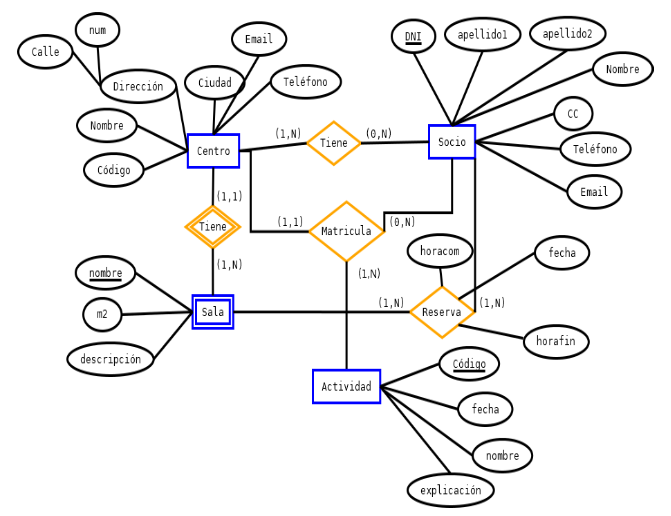

# Ejercicio 1 — Script de *deploy* basado en modelo E/R (Gimnasio)

## Objetivo del ejercicio

A partir del siguiente modelo Entidad–Relación (gimnasio / centro deportivo), debéis diseñar y programar un script SQL llamado:

```
deploy_gimnasio.sql
```

Este script debe crear **toda la estructura de la base de datos**, incluyendo tablas, claves primarias, claves foráneas, restricciones y validaciones.

---

## Modelo Entidad–Relación de referencia

> Utilizad este E/R como base para construir las tablas y relaciones.
> (Añade la imagen en tu repositorio o en el README cuando lo subas)

**Modelo E/R del Gimnasio:**


---

## 1. Creación de la base de datos

El script debe:

1. Borrar la BBDD si existe.
2. Crear de nuevo la base de datos.
3. Seleccionarla con `USE`.

Ejemplo de arranque:

```sql
DROP DATABASE IF EXISTS gimnasio_bbdd;
CREATE DATABASE gimnasio_bbdd;
USE gimnasio_bbdd;
```

---

## 2. Tablas obligatorias (según el E/R)

Debéis crear, como mínimo, las siguientes tablas:

- Centro
- Sala
- Socio
- Actividad

Las tablas que representen las relaciones:
- Matricula (entre Socio y Actividad)
- Reserva (entre Socio, Sala y Actividad, según el modelo)

Las columnas de cada tabla deben salir de los atributos del diagrama (DNI, nombre, apellidos, m2, fecha, horacom, horafin, etc.)
> 💡 Los nombres finales puedes adaptarlos libremente, pero **deben corresponderse con el E/R**.

---

## 3. Claves primarias y foráneas

Cada tabla debe tener:

* **PRIMARY KEY** correctamente definida.
* Todas las **FOREIGN KEY** necesarias para representar las relaciones del modelo.
* En las tablas de unión (`Matrícula`, `Reserva`), **usar claves primarias compuestas** cuando tenga sentido.

### Requisito obligatorio:

Las relaciones principales deben incluir:

```sql
ON DELETE CASCADE
ON UPDATE CASCADE
```

para evitar datos huérfanos.

---

## 4. Restricciones e índices

El script debe incluir al menos:
- Una restriccioón `CHECK` lógica (por ejemplo que m2 > 0, que hora fin > horacom, etc.)
- Índice en `nombre` de actividad
- Índice en `email` o `telefono` del socio

---

## 5. Comprobaciones al final del script

Al final del archivo `deploy_gimnasio.sql`, incluir:

- Mostrar las tablas creadas:
```sql
SHOW TABLES;
```
- Mostrar la estructura de las tablas principales (`DESCRIBE`)

---

## 6. Apoyo y referencia

Podéis usar como guía la base de datos `clase_bbdd` vista anteriormente para recordar:

* Cómo se crean claves primarias.
* Cómo se definen claves foráneas con `ON DELETE CASCADE` y `ON UPDATE CASCADE`.
* Cómo se distribuyen correctamente los scripts en partes lógicas.

En este ejercicio **solo se pide el script de creación**.
La carga de datos formará parte del ejercicio siguiente.

---

## 📝 Resultado esperado

Un archivo:

```
deploy_gimnasio.sql
```

Que, al ejecutarlo en HeidiSQL o Workbench, genere TODA la estructura del modelo E/R del gimnasio sin errores.
